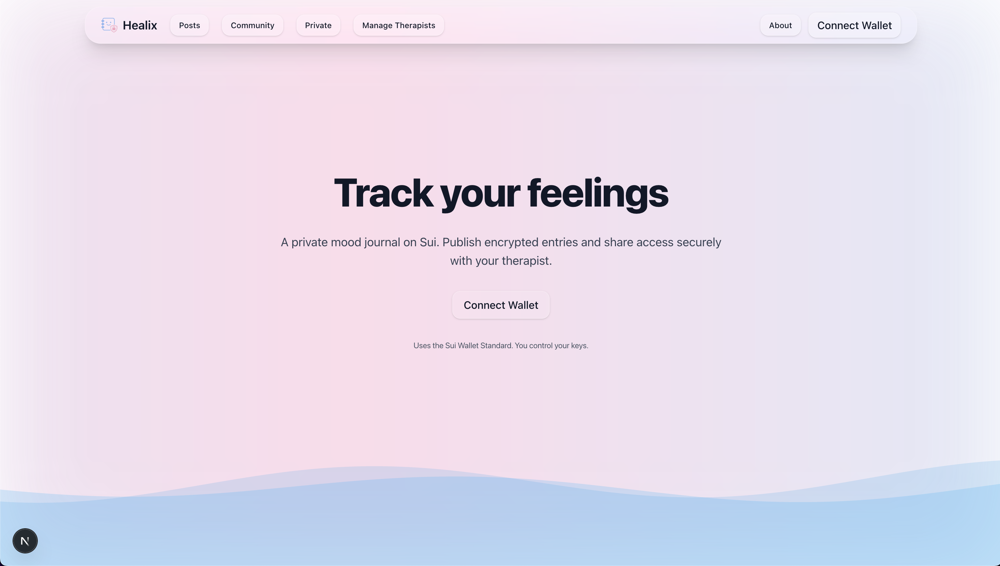
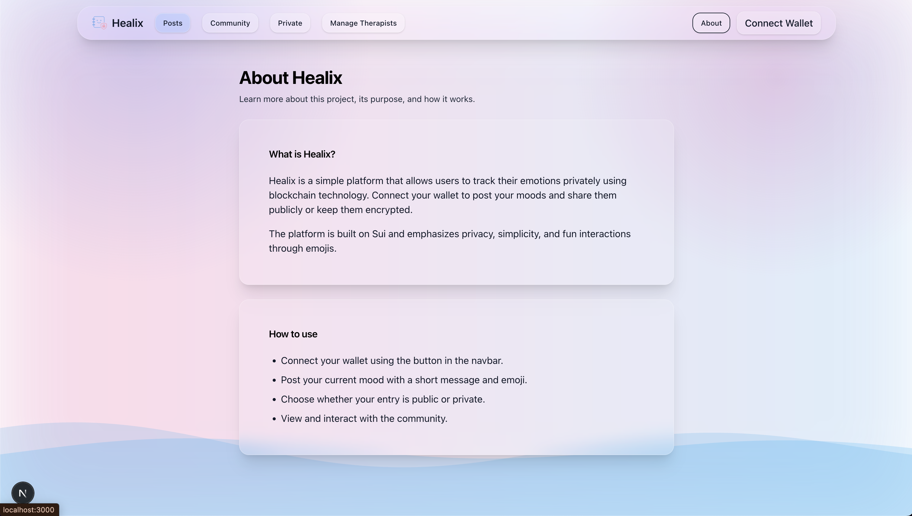
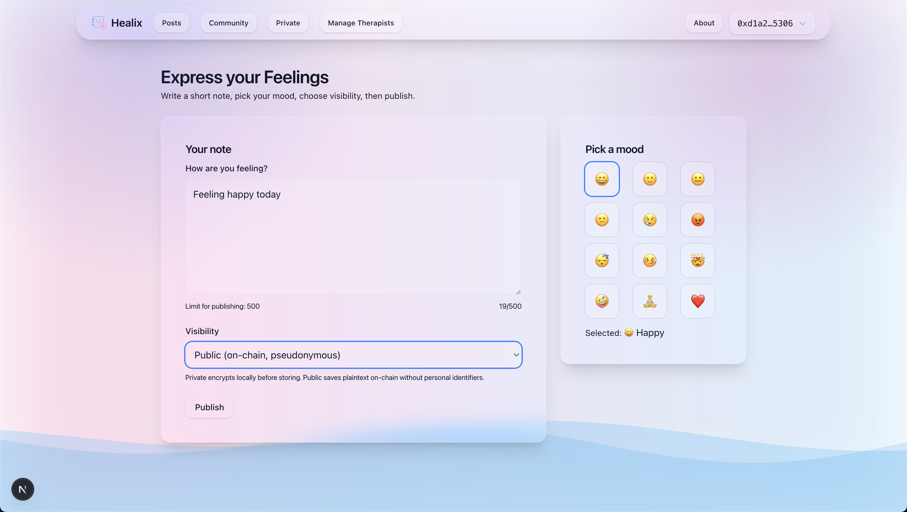
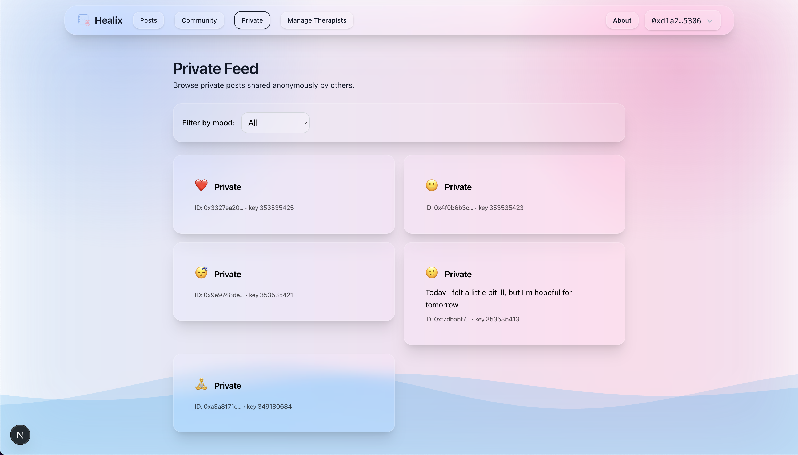

# Healix

**Healix** is a decentralized platform for sharing and tracking personal emotions securely on the Sui blockchain. Users can post moods and messages publicly or privately with full encryption, ensuring privacy and control over their data.

## 🚀 Key Features

- **Public & Private Posts**  
  Post your current mood with emojis and short messages. Public posts are visible to everyone, while private posts are **encrypted on-chain using SEAL**, ensuring only authorized users can access them.

- **On-Chain Encryption with SEAL**  
  Private messages are encrypted on the blockchain using the SEAL library and smart contracts. Only users explicitly on an allowlist can decrypt these messages.

- **Allowlist Access Control**  
  Uses Walrus modules for allowlists and subscription patterns, providing secure, permissioned access to private messages.

- **Immutable & Decentralized Storage**  
  All posts are stored as Move objects on Sui, guaranteeing immutability and ownership.

- **Community Feed**  
  Browse public posts shared pseudo-anonymously, filter by mood, and interact with the community.

- **Wallet Integration**  
  Connect your wallet via `@mysten/dapp-kit` to post messages, sign personal messages, and decrypt private content.

## 🛠 Tech Stack

**Frontend**
- React (Next.js) with client components (`use client`)  
- `@mysten/dapp-kit`: wallet connection, signing personal messages  
- SEAL: on-chain private message encryption  
- Walrus: allowlist and subscription modules for access control  
- Tailwind CSS + custom glassmorphism styles  

**Blockchain & Smart Contracts**
- Sui Blockchain (Testnet)  

**Move Modules**
- `pacient::pacient`, `pacient::database`, `pacient::feed` → store posts, notes, feeds  
- `walrus::allowlist` → manage allowlist access  
- `walrus::subscription` → subscription-based access patterns  
- `walrus::utils` → helper functions for prefix matching  

**Sui Packages**
- `@mysten/sui/client` → interact with fullnode  
- `@mysten/sui/transactions` → build transactions and Move calls  
- `@mysten/bcs` → serialization (`fromHex`, `toHex`)  

**Security & Encryption**
- SEAL encryption ensures that only users with the correct allowlist access and session key can decrypt private messages.  
- Private messages are encrypted on-chain, not just in the frontend.

## 📝 How It Works

### Posting a Mood
1. Users connect their wallet via Dapp Kit.  
2. Choose an emoji and message, select visibility (public/private).  
3. Public posts are stored directly on-chain.  
4. Private posts are encrypted with SEAL, stored as Move objects, and linked to allowlists.

### Decryption Flow (Private Posts)
1. A session key is created for the current wallet.  
2. The user signs a personal message to validate ownership.  
3. A transaction is constructed for `seal_approve` in Walrus smart contracts.  
4. Only allowlisted users can decrypt the message on-chain using SEAL.

### Community Feed
- Fetches the latest posts (public only) from Sui Move objects.  
- Filters by mood using emojis.  
- Displays content with glassmorphism UI components.

## 🧩 Smart Contract Usage

**Move Modules**
- `pacient::database` → Creates a database object to store `NoteEntry` objects.  
- `pacient::feed` → Maintains a feed of posts (addresses of Move objects).  
- `pacient::pacient` → Handles posting of messages and notes with timestamp and author.  
- `walrus::allowlist` → Manage who can access private messages.  
- `walrus::subscription` → Optional subscription-based access pattern.  
- `walrus::utils` → Helper functions for internal logic.

**Key Points**
- Private messages are encrypted on-chain using SEAL.  
- Only allowlisted addresses can access encrypted messages via `seal_approve`.  
- Public posts are fully readable by everyone.

## 🔐 Security & Privacy
- All private posts are encrypted on-chain using SEAL, not stored locally.  
- Only allowlisted users can decrypt messages.  
- No sensitive data is stored off-chain.  
- Wallet connection is required for signing messages and accessing encrypted content.

## 🎨 Screenshots
### Homepage

### About Page

### Post a Mood

### Private Post (Encrypted)

## 🎥 Demo Video

Check out a quick walkthrough of Healix in action:  
[▶️ Watch on YouTube](https://www.youtube.com/watch?v=dAUoh2U_bx8)
